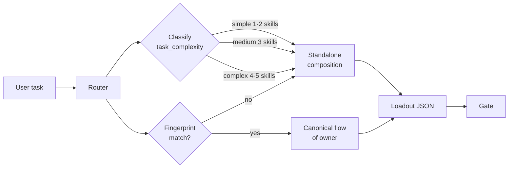
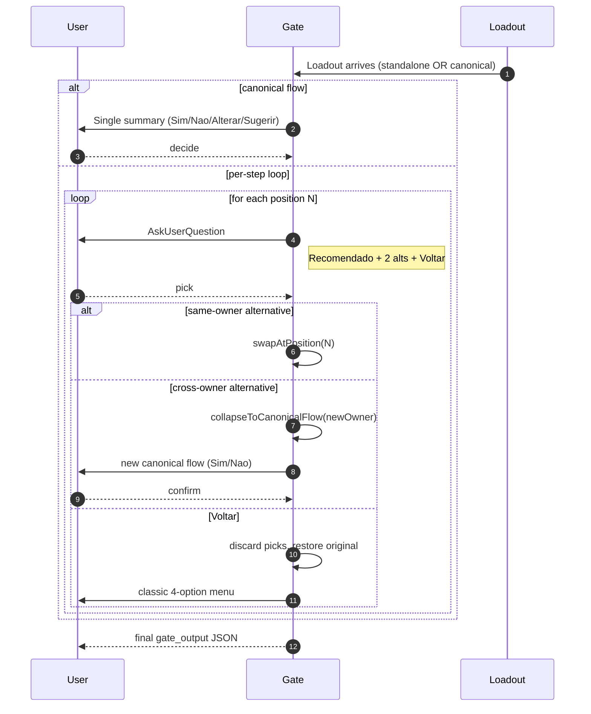
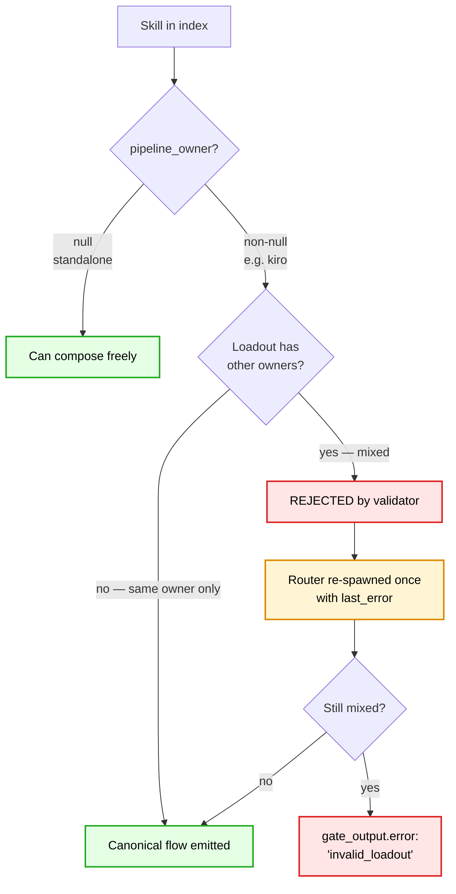

<p align="center">
  
</p>

<h1 align="center">Skill Advisor</h1>

<p align="center">
  <strong>The AI that learns which AI tools to use</strong><br>
  <em>Intelligent toolchain orchestrator for Claude Code — one task, the right skills.</em>
</p>

<p align="center">
  <a href="#installation"></a>
  <a href="https://github.com/fernandoxavier02/skill-advisor/releases/tag/v0.3.4"></a>
  <a href="#how-it-works"></a>
  <a href="tests/"></a>
  
  
</p>

<p align="center">
  <a href="#tldr">TL;DR</a> ·
  <a href="#features">Features</a> ·
  <a href="#how-it-works">How it works</a> ·
  <a href="#quickstart">Quickstart</a> ·
  <a href="#commands">Commands</a> ·
  <a href="CHANGELOG.md">Changelog</a>
</p>

<p align="center">
  You have 200+ skills installed. You use 10. Skill Advisor finds the other 190 — and knows which ones not to mix.
</p>

---

## TL;DR

Skill Advisor routes any Claude Code task to the right combination of skills, plugins, MCP servers, and agents. Instead of one monolithic pipeline, you get a **proportional loadout** sized to the task, with a **per-step picker** so you choose which skill runs at each position. It enforces a hard invariant: skills from orchestrated plugins (Superpowers, Kiro, SDD, Compound Engineering, Pipeline Orchestrator) never get mixed — if you pick one, the loadout collapses to that plugin's native flow.

```
You type:  /advisor "fix the login regression"

Advisor:   Task classified → simple. Standalone composition.
           Loadout: /investigate → /fix → /review

           Per-step picker:
           Step 1: /investigate (Recomendado) | /systematic-debugging | /kiro-debug
           Step 2: /fix (Recomendado)         | /simplify              | /ce-work
           Step 3: /review (Recomendado)      | /code-review          | /simplify
           → pick each with arrow keys, Enter, Voltar to abort
```

Three steps. No monolithic gate. No cross-plugin contamination.

---

## Features

| Feature | What it does | Since |
|---|---|---|
| **Per-step loadout picker** | `AskUserQuestion` menu per position — recommendation + 2 alternatives + Voltar. Swap one skill without restarting the whole flow. | 0.3.2 |
| **Pipeline-owner isolation** | Curated list (`superpowers`, `kiro`, `sdd`, `compound-engineering`, `pipeline-orchestrator`). A loadout can never mix skills from two owners. Picking one triggers collapse to its canonical flow. | 0.3.2 |
| **Task-complexity-aware sizing** | Router classifies `simple / medium / complex` and sizes standalone loadouts to 1-2 / 3 / 4-5 skills. No more 4-step ceremony for a one-line fix. | 0.3.2 |
| **Fingerprint-match routing** | Each pipelined plugin has a functional fingerprint (`best_for`, `typical_tasks`, `not_for`, `complexity_match`). The router recognizes when a task fits a plugin end-to-end and recommends the canonical flow unprompted. | 0.3.2 |
| **Prompt-injection sanitizer** | `lib/escaping.js` implements the BEGIN/END marker contract, backtick redaction, control-char stripping, and field length caps from Rule 12. No more prose-only defense. | 0.3.3 |
| **Hook nudge** | Sub-50ms scan of every user prompt surfaces underused high-signal skills via `advisor-nudge.cjs`. Zero network, local-only. | 0.1+ |
| **Semantic search** | 384-dim embeddings over skill cards via `@huggingface/transformers`. Weighted with keyword + graph traversal. | 0.2+ |

---

## How it works

Three diagrams cover the whole architecture.

### Router — from task to loadout



The router is a single Claude subagent call. It reads the task description, classifies complexity, checks each `PIPELINE_FINGERPRINT` for a match, and emits a loadout. If a fingerprint matches (e.g., "create a spec for the auth refactor" → kiro), the loadout is the plugin's canonical flow. Otherwise it composes standalone skills sized to complexity.

### Gate — per-step picker



The gate uses the native `AskUserQuestion` tool — arrow-key selection, automatic "Other" free-text option. Three outcomes: all recommendations kept (`decision: "approve"`), at least one alternative picked (`decision: "custom"`), or collapse to a canonical flow (`decision: "custom"` with the new loadout).

### Pipeline-owner isolation — why loadouts never mix



A skill from `superpowers` and a skill from `sdd` in the same loadout would break both plugins' contracts — each assumes it owns the entire flow. The router self-validates; the gate re-validates; if both miss it, `lib/schemas.js` rejects with `mixed_pipeline_owners`. The retry budget (single re-spawn) is documented separately from the malformed-JSON retry.

---

## Quickstart

### Installation

Via the FX Studio AI marketplace:

```bash
# In Claude Code
/plugin install skill-advisor@FX-studio-AI
```

Or direct from source:

```bash
git clone https://github.com/fernandoxavier02/skill-advisor.git
cd skill-advisor
npm install
npm run index   # scan installed skills/plugins and build the index
```

### First use

```
/advisor "your task in plain language"
```

The advisor will:

1. **Route** — classify complexity, check fingerprints, compose a loadout
2. **Present** — dry-run with flow, confidence, alternatives per position
3. **Gate** — per-step picker if standalone, summary if canonical
4. **Execute** — invoke the approved loadout in order

Example tasks that route differently:

| Task | Classification | Loadout |
|---|---|---|
| `"fix typo in auth.ts line 47"` | simple | `/investigate → /fix` |
| `"add retry logic with exponential backoff"` | medium | `/investigate → /writing-plans → /test-driven-development → /review` |
| `"create a spec for the auth refactor"` | fingerprint: kiro | `/kiro-discovery → /kiro-spec-quick → /kiro-impl → /kiro-validate-impl` |
| `"audit security posture of this codebase"` | fingerprint: pipeline-orchestrator | `/pipeline-orchestrator:pipeline` |

---

## Commands

| Command | What it does |
|---|---|
| `/advisor <task>` | Main entry — route, gate, execute |
| `/advisor --template <name>` | Load a saved workflow template and skip routing |
| `/advisor-index` | Rebuild the keyword + semantic + graph indexes |
| `/advisor-catalog` | List all indexed skills grouped by plugin |
| `/advisor-config` | Toggle hook, adjust thresholds, enable debug |
| `/advisor-feedback` | Record outcome of the last pipeline execution |
| `/advisor-stats` | Session analytics and skill usage heat map |

---

## Architecture

### Directory layout

```
skill-advisor/
├── agents/
│   ├── advisor-router.md    # LLM subagent: task → loadout
│   └── advisor-gate.md      # LLM subagent: per-step picker
├── commands/                # Slash command definitions
├── hooks/
│   └── advisor-nudge.cjs    # <50ms hook on every user prompt
├── lib/
│   ├── constants.js         # PIPELINE_OWNERS, CANONICAL_FLOWS, FINGERPRINTS
│   ├── build-index.js       # Full + lite index builder
│   ├── build-embeddings.js  # Semantic vectors (384-dim, MiniLM-L6-v2)
│   ├── build-graph.js       # Obsidian vault graph
│   ├── semantic.js          # Cosine similarity search
│   ├── graph-search.js      # BFS 2-hop traversal
│   ├── schemas.js           # Router output + gate output validators
│   ├── loadout.js           # swapAtPosition + collapseToCanonicalFlow
│   └── escaping.js          # Prompt-injection sanitizer (Rule 12)
└── tests/                   # 500 tests — `npm test`
```

### Data flow

Two execution paths coexist:

**Hook path (real-time, ~<50ms):** every user prompt goes through `advisor-nudge.cjs`, which reads the lite index, tokenizes with PT-BR→EN synonym expansion, runs semantic + keyword matching, and emits a nudge to stdout if the top score beats the threshold.

**Command path (`/advisor`):** richer — reads the full index, gathers git/project context, spawns the router subagent, presents the dry-run, spawns the gate subagent, executes the approved loadout. See `commands/advisor.md` for the 10-step contract.

### Prompt-injection defenses

External fields (`task_description`, `codebase_context`, `loadout_json`, skill entries) pass through `lib/escaping.js` before any subagent spawn. The contract redacts runs of 3+ backticks, strips control characters, caps field lengths (`task_description` 2000, `codebase_context` 4000, per-skill 300, `loadout_json` 8000), and wraps each block in `BEGIN/END` markers that the subagent is instructed to treat as DATA.

---

## Development

```bash
npm install
npm test          # 500 tests via node --test
npm run index     # rebuild keyword + lite indexes
node lib/build-embeddings.js     # rebuild semantic embeddings (~2-5 min first run)
node lib/build-graph.js          # rebuild Obsidian vault graph
```

Test runner: Node.js built-in `--test` pattern `tests/*.test.js`. No external test framework.

### Contributing

1. Fork the repo
2. Create a feature branch — naming convention `feat/<description>` or `fix/<description>`
3. Add tests for any new behavior (see `tests/advisor-loadout-composition.test.js` for the pattern)
4. Run `npm test` locally before opening PR
5. Commit with [Conventional Commits](https://www.conventionalcommits.org/) format
6. PR against `main`

---

## Release history

See [CHANGELOG.md](CHANGELOG.md) for the full timeline.

Latest: **[v0.3.4](https://github.com/fernandoxavier02/skill-advisor/releases/tag/v0.3.4)** (2026-04-24) — manifest sync fix. Prior releases (0.3.1 → 0.3.3) added the per-step picker, pipeline-owner isolation, complexity-aware sizing, fingerprint routing, and the `lib/escaping.js` sanitizer.

---

## License

MIT © [FX Studio AI](https://github.com/fernandoxavier02). See [LICENSE](LICENSE).

<p align="center">
  <sub>Built for Claude Code. Powered by semantic search, graph traversal, and a stubborn belief that the right tool matters.</sub>
</p>
