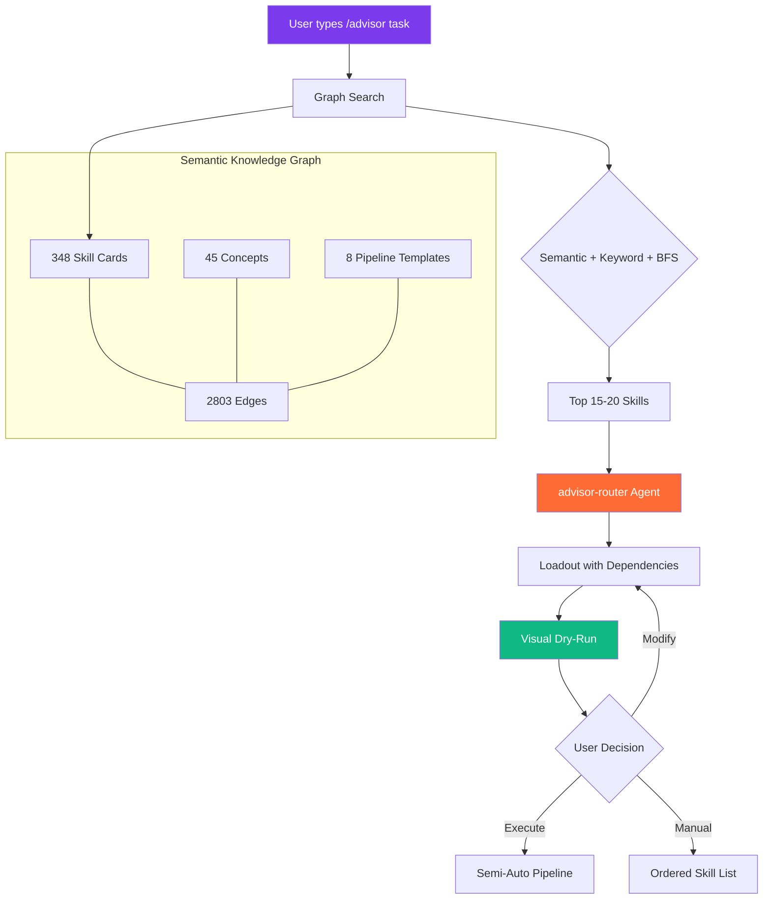

<p align="center">
  
</p>

<h1 align="center">Skill Advisor</h1>

<p align="center">
  <strong>Intelligent Cross-Plugin Orchestration for Claude Code</strong>
</p>

<p align="center">
  <a href="https://fxstudioai.com"></a>
</p>

<p align="center">
  <a href="#installation"></a>
  
  
  
  
  
  
</p>

<p align="center">
  <em>Stop guessing which skill to use. The Advisor finds the optimal loadout for any task.</em>
</p>

---

## The Problem

You have 200+ skills, plugins, MCPs, and agents installed. For any given task, you need to know:

- **Which** skills to use
- **In what order** to run them
- **How they connect** (what output feeds the next input)
- **Which combinations** work best across different plugins

Skill Advisor solves this by maintaining a **semantic knowledge graph** of your entire toolchain and recommending optimal skill compositions in real-time.

---

## How It Works



### Three-Layer Search Pipeline

| Layer | Method | Speed | Purpose |
|-------|--------|-------|---------|
| **1. Semantic** | Cosine similarity on 384-dim embeddings (MiniLM-L6) | ~15ms | Meaning-aware matching |
| **2. Graph** | BFS traversal with convergence + category boosts | ~5ms | Cross-plugin discovery via edges |
| **3. Keyword** | PT-BR/EN synonym expansion + weighted scoring | ~3ms | Fallback for cold start |

All three layers run **locally with zero network calls**. The search pipeline degrades gracefully: if embeddings aren't available, graph search takes over; if the graph is empty, keyword matching handles it.

---

## Features

### Cross-Plugin Composition

The advisor doesn't follow one plugin's workflow. It **mixes skills from any installed plugin** to build the optimal pipeline:

```
Example: "Build a payment feature with Stripe on Supabase"

  Phase 1: /sdd:brainstorm        (context-engineering-kit)
  Phase 2: /investigate            (superpowers)
  Phase 3: /office-hours           (gstack) 
  Phase 4: /sdd:plan              (context-engineering-kit)
  Phase 5: /pipeline:executor      (pipeline-orchestrator)
  Phase 6: /reflexion:critique     (context-engineering-kit)
```

### Bilingual Engine (PT-BR / EN)

50+ synonym mappings bridge Portuguese and English seamlessly:

```
"auditar seguranca" → audit, review, security, safe
"corrigir bug no login" → fix, debug, bug, auth, login, authentication
```

### Obsidian Knowledge Base

The advisor maintains an Obsidian vault as its brain:

| Component | Count | Purpose |
|-----------|-------|---------|
| Skill cards | 348 | Rich metadata per skill (I/O, workflow, composition) |
| Concept notes | 45 | Theme nodes linking skills across domains |
| Pipeline templates | 8 | Pre-built sequences for common workflows |
| Graph nodes | 401 | Skills + concepts + pipelines |
| Graph edges | 2,803 | Explicit (wikilinks) + semantic connections |
| Aliases | 549 | PT-BR + EN + variations for matching |

### Real-Time Nudging (opt-in)

A lightweight hook (<50ms) analyzes your prompts and suggests `/advisor` when relevant:

```
[Advisor] Considere /advisor — detectei relevancia com: /investigate (85%), /fix (72%)
```

Disabled by default. Enable with `/advisor-config enable`.

---

## Commands

| Command | Description |
|---------|-------------|
| `/advisor <task>` | Analyze task and recommend optimal skill loadout |
| `/advisor-index` | Rebuild keyword index + semantic embeddings |
| `/advisor-catalog` | Generate/rebuild Obsidian vault knowledge base |
| `/advisor-config status` | Show current configuration |
| `/advisor-config enable` | Enable automatic hook suggestions |
| `/advisor-config disable` | Disable automatic hook |
| `/advisor-config threshold 0.3` | Adjust hook sensitivity (0.0 - 1.0) |
| `/advisor-feedback` | Record feedback on last recommendation |

---

## Architecture

```
skill-advisor/
├── agents/
│   └── advisor-router.md         # Sonnet subagent — task classifier + loadout builder
│
├── commands/
│   ├── advisor.md                # Main recommendation engine
│   ├── advisor-catalog.md        # Obsidian vault generator
│   ├── advisor-config.md         # Configuration manager
│   ├── advisor-feedback.md       # Feedback collector
│   └── advisor-index.md          # Index rebuilder
│
├── hooks/
│   ├── advisor-nudge.cjs         # UserPromptSubmit hook (<50ms, zero network)
│   └── hooks.json                # Hook registration
│
├── skills/
│   └── advisor-skill/
│       └── SKILL.md              # Auto-trigger skill
│
├── lib/                          # Core engine
│   ├── frontmatter.js            # Unified YAML parser (prototype pollution safe)
│   ├── constants.js              # Centralized tunable parameters (Object.freeze)
│   ├── text.js                   # Tokenizer + PT-BR/EN synonym bridge
│   ├── errors.js                 # Structured error handling (AdvisorError + debugLog)
│   ├── schemas.js                # 8 JSDoc data schemas with validators
│   ├── build-index.js            # Multi-source scanner → two-tier index
│   ├── build-embeddings.js       # 384-dim vectors via transformers.js
│   ├── semantic.js               # Cosine similarity search (pre-computed, no model at runtime)
│   ├── build-graph.js            # Obsidian vault → adjacency graph
│   ├── graph-search.js           # BFS traversal + scoring + alias matching
│   ├── build-catalog.js          # Plugin/skill source scanner for vault generation
│   └── paths.js                  # Path resolution for all artifacts
│
├── vault-skills/                 # 348 Obsidian skill cards
├── vault-concepts/               # 45 concept notes with backlinks
├── vault-pipelines/              # 8 pipeline templates
├── vault-graph/                  # adjacency.json + stats.json
│
├── tests/                        # 287 tests, 0 failures
│   ├── frontmatter.test.js
│   ├── constants.test.js
│   ├── text.test.js
│   ├── errors.test.js
│   ├── schemas.test.js
│   ├── graph-search.test.js
│   ├── semantic.test.js
│   ├── build-catalog.test.js
│   ├── build-index.test.js
│   ├── advisor-nudge.test.js
│   ├── paths.test.js
│   └── fixtures/                 # Deterministic test data
│
└── plugin.json                   # Plugin manifest
```

---

## Installation

### From FX Studio AI Marketplace

The plugin is distributed via the **FX Studio AI** marketplace for Claude Code.

### Verify Installation

```bash
grep "skill-advisor" ~/.claude/settings.json
# Expected: "skill-advisor@FX-studio-AI": true
```

### First-Time Setup

```bash
/advisor-index          # Build keyword + semantic index (~2 min first run)
/advisor-catalog        # (Optional) Generate Obsidian vault
```

---

## Configuration

### Hook Sensitivity

| Value | Behavior |
|-------|----------|
| `0.15` | Very sensitive — suggests often |
| `0.20` | Default — balanced |
| `0.35` | Conservative — only strong matches |
| `0.50` | Minimal — near-exact matches only |

```
/advisor-config threshold 0.25
```

### Environment Variables

```bash
ADVISOR_ENABLED=true       # Override config to enable hook
ADVISOR_THRESHOLD=0.35     # Override threshold
ADVISOR_DEBUG=true         # Enable debug logging to stderr
```

---

## Performance

| Metric | Target | Actual |
|--------|--------|--------|
| Hook latency | <50ms | ~15-30ms |
| Lite index size | <100KB | 85.6KB |
| Semantic search | <20ms | ~15ms |
| Graph BFS | <10ms | ~5ms |
| Network calls | 0 | 0 |
| Test suite | 287 tests | 287 pass, 0 fail |

---

## Privacy

- All processing runs **locally** on your machine
- **Zero network calls** at runtime
- Embeddings model downloaded once (~23MB), cached locally
- Telemetry is local-only (`lib/advisor-telemetry.jsonl`)

---

## Roadmap (v2.0)

Skill Advisor v2.0 evolves from a recommendation engine into a **full orchestration platform**:

- [ ] **6 specialized agents** — router, clarifier, planner, executor, monitor, documenter
- [ ] **Pluggable embedding adapter** — local MiniLM default, any OpenAI-compatible endpoint
- [ ] **Enriched vault cards** — workflow details, I/O contracts, composition edges
- [ ] **Semantic edge materialization** — strong edges at build-time, weak at query-time
- [ ] **Orchestrated execution** — `--auto` (continuous) or `--gated` (per-phase approval)
- [ ] **Living pipeline specs** — document generated before, updated during, report after
- [ ] **Execution memory** — JSONL + vault notes feedback loop that improves recommendations

Full design spec: [`.specs/plans/skill-advisor-v2-orchestration-platform.design.md`](.specs/plans/skill-advisor-v2-orchestration-platform.design.md)

---

## Dependencies

| Package | Purpose | Size |
|---------|---------|------|
| `@huggingface/transformers` | Local semantic embeddings | ~23MB (first run) |
| Node.js >= 18 | Runtime | System |

No other dependencies. Pure Node.js.

---

## Contributing

1. Fork the repository
2. Create a feature branch (`git checkout -b feature/my-feature`)
3. Run tests (`npm test`) — all 287 must pass
4. Commit with conventional messages
5. Open a Pull Request

---

## License

MIT

---

<p align="center">
  
  <br />
  <strong>Built by <a href="https://github.com/fernandoxavier02">Fernando Xavier</a></strong>
  <br />
  <a href="https://fxstudioai.com">FX Studio AI</a> — Intelligent AI Tooling
</p>
